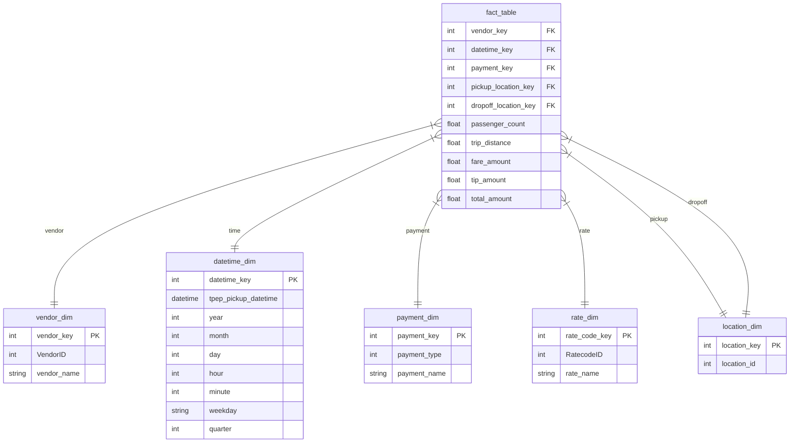

# 🚕 NYC Taxi Insights

📊 **[View Interactive Dashboard Here](https://datastudio.google.com/reporting/1bb78609-0d06-4a9b-a945-969de96fddc7)**

## 📖 Project Overview
**NYC Taxi Insights** is a robust, end-to-end Data Engineering pipeline designed to process, clean, model, and visualize large-scale NYC TLC Yellow Taxi trip data. The primary objective of this project is to transform a massive, flat, raw dataset into a highly optimized **Star Schema** within Google BigQuery, ultimately powering an interactive Looker Studio dashboard for business intelligence reporting.

## 🏗️ Architecture & Pipeline Flow
1. **Data Extraction**: Raw `yellow_tripdata` Parquet files are loaded into Python via Pandas.
2. **Data Transformation**: Python & Pandas are used within a Mage AI block to clean the data (removing missing values/duplicates) and transform the flat structure into a relational **Star Schema**.
3. **Orchestration**: **Mage AI** is used to orchestrate the data pipeline, ensuring modular block execution and dependency management.
4. **Data Warehousing**: The transformed Dimension and Fact tables are exported to **Google Cloud BigQuery** for high-performance OLAP querying.
5. **Data Visualization**: BigQuery is connected to **Looker Studio** to create an interactive dashboard.

## 🗄️ Data Modeling (Star Schema)
The core of this project revolves around architecting a relational data model by decomposing the flat dataset into a highly efficient Star Schema. 



- **Fact Table**: `fact_table` (Contains quantitative metrics like `fare_amount`, `tip_amount`, `total_amount`, `passenger_count`, `trip_distance` and foreign keys to all dimension tables)
- **Dimension Tables**: 
  - `datetime_dim`
  - `payment_dim`
  - `location_dim` (Handles both pickup and dropoff locations)
  - `vendor_dim`
  - `rate_dim`

## 🛠️ Tech Stack & Tools
* **Language:** Python 3.12
* **Dependency Management:** uv
* **Data Processing:** Pandas, PyArrow, Numpy
* **Orchestration:** Mage AI
* **Containerization:** Docker
* **Cloud Data Warehouse:** Google Cloud BigQuery
* **Data Visualization:** Looker Studio

## 🚀 Getting Started

### Prerequisites
1. Docker and Docker Compose installed.
2. A Google Cloud account with a BigQuery dataset created.
3. A Google Cloud Service Account JSON key.

### Setup Instructions
1. **Download the Dataset:**
   Download the [NYC TLC Trip Record Data (Yellow Taxi)](https://www.nyc.gov/site/tlc/about/tlc-trip-record-data.page) Parquet file (e.g., January 2026).
   Create a `data/` folder in the root directory and place the downloaded file there as `yellow_tripdata_2026-01.parquet`.
   ```bash
   mkdir data
   # Place yellow_tripdata_2026-01.parquet inside the data folder
   ```

2. **Configure Google Cloud Credentials:**
   Ensure your `.env` or system environment has the `GOOGLE_APPLICATION_CREDENTIALS` variable pointing to your JSON key path.
   Set `GOOGLE_CLOUD_PROJECT` to your GCP Project ID.

3. **Start the Pipeline Server:**
   Run the project using Docker:
   ```bash
   docker-compose up --build
   ```

4. **Run the Pipeline:**
   Navigate to `http://localhost:6789` in your web browser. 
   Go to the `nyc_taxi_pipeline` and click "Run pipeline" to execute the data load, transform, and export tasks automatically.

## 📁 Data Dictionary
A cheatsheet explaining all the dataset columns is included in this repository as `data_dictionary_trip_records_yellow.pdf`.
